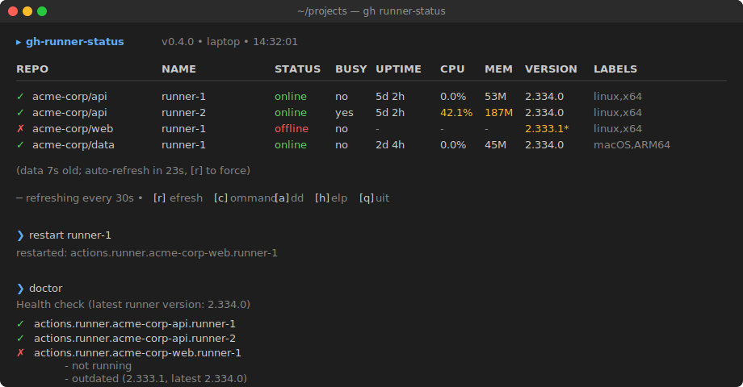

# gh-runner-status

[](https://github.com/crgeee/gh-runner-status/actions/workflows/ci.yml)
[](LICENSE)

> One terminal command to see, control, and alert on every self-hosted GitHub Actions runner you own.

<p align="center">
  
</p>

## ⚡ Quick start

**Three lines and you're running:**

```bash
brew install gh jq                                  # one-time prereqs (macOS)
gh auth login                                       # one-time, pick HTTPS + repo scope
gh extension install crgeee/gh-runner-status
```

Then:

```bash
gh runner-status owner/repo                         # status of one repo
gh runner-status                                    # interactive REPL (in a terminal)
```

That's it.

> **Linux?** Replace `brew install gh jq` with `sudo apt-get install -y gh jq` (Debian/Ubuntu), `sudo dnf install -y gh jq` (Fedora), or `sudo pacman -S github-cli jq` (Arch). For Telegram alerts you also need `curl` (almost certainly already installed).

## What it does

- **`list`** — one table for runners across every repo you care about
- **`start` / `stop` / `restart` / `logs`** — control runners on the local machine
- **`watch`** — auto-refresh table on an interval
- **`notify`** — Telegram alert when something goes offline (cron-friendly)
- **REPL** — bare `gh runner-status` opens a Claude-Code-style prompt with slash commands

GitHub's UI makes you click into each repo's Settings → Actions → Runners page one at a time. This bundles them into one view and adds local control + alerting.

## Configure your fleet

Drop one repo per line in `~/.config/gh-runner-status/repos`:

```
acme-corp/api
acme-corp/web
acme-corp/data
```

Now `gh runner-status` (no args, but inside a TTY → REPL; piped/cron → table) shows them all.

## Common usage

```bash
gh runner-status                                    # repos from config (or REPL)
gh runner-status owner/repo                         # one-off
gh runner-status owner/repo-a,owner/repo-b          # multiple
gh runner-status --json | jq '.[] | select(.status == "offline")'

gh runner-status local                              # list runners on this machine
gh runner-status restart actions.runner.org-repo.name

gh runner-status watch                              # 30s auto-refresh (Ctrl-C exits)
gh runner-status watch 5                            # 5s refresh

gh runner-status notify                             # Telegram alert on issues
```

The runner name passed to `start`/`stop`/`restart`/`logs` is the LaunchAgent label on macOS (`actions.runner.OWNER-REPO.NAME`) or the systemd service name on Linux. `gh runner-status local` shows you the names.

## Interactive dashboard

Run `gh runner-status` with no args (in a terminal) and you land on a **live, auto-refreshing dashboard** with single-key controls:

```
▸ gh-runner-status v0.2.0 • laptop • 14:32:01
  uptime: 5d 2h • load: 1.2 1.4 1.5 • mem: 8.2/16G

  REPO            NAME        STATUS   BUSY  LABELS
-----------------------------------------------------
✓ acme-corp/api   runner-1    online   no    self-hosted,linux,x64
✓ acme-corp/api   runner-2    online   yes   self-hosted,linux,x64
✗ acme-corp/web   runner-1    offline  no    self-hosted,linux,x64

─ refreshing every 30s • [r]efresh [c]ommand [/]slash [a]dd [q]uit
```

**Single-key controls** (no Enter needed):

| Key | What it does |
|---|---|
| `r` | Refresh now (instead of waiting for the timer) |
| `c` | **Command mode** — type a full command (`restart NAME`, `notify`, etc.) and the dashboard pauses until it finishes |
| `/` | Slash command (`/help`, `/repos`, `/quit`) |
| `a` | Quick path to `add OWNER/REPO` — register a new runner |
| `h`, `?` | Show full help |
| `q`, `Ctrl-D`, `Ctrl-C` | Quit cleanly back to the shell |

Command-mode aliases: `l`/`ls` → `list`, `r` → `restart`, `s` → `start`, `x` → `stop`, `n` → `notify`, `w` → `watch`, `a` → `add`.

Custom interval: `gh runner-status watch 5` opens the same dashboard refreshing every 5 seconds. The default `gh runner-status` is 30s.

## Local runner metrics

`gh runner-status local` now shows running PIDs, process uptime, CPU%, and resident memory for every runner installed on the current machine — so you can see at a glance which agents are alive and how much they're using:

```
$ gh runner-status local

  NAME                                              PID    UPTIME   CPU   MEM
-------------------------------------------------------------------------------
✓ actions.runner.acme-api.runner-1                  1234   2d 4h    0.0%  45M
✓ actions.runner.acme-web.runner-1                  1235   2d 4h    0.0%  43M
✗ actions.runner.acme-data.runner-1                 -      -        -     -
```

`--json` output includes the same metrics for scripting.

## Add or remove a runner

Register a new runner against a repo without touching GitHub's web UI:

```bash
gh runner-status add acme-corp/api                  # auto-uses hostname for runner name
gh runner-status add acme-corp/api my-runner        # custom runner name
gh runner-status add acme-corp/api my-runner gpu,linux,x64   # custom labels
```

The command:
1. Calls the GitHub API to mint a registration token (valid ~1 hour)
2. Adds the repo to your local config file (so `gh runner-status` will list it)
3. Prints copy-paste commands you run on the *target machine* to download, configure, and install the runner as a service

It deliberately does NOT ssh into the target — installation needs sudo on Linux and platform-specific paths, so the user-facing flow is "here's exactly what to paste."

To deregister:

```bash
gh runner-status remove acme-corp/api my-runner     # by name
gh runner-status remove acme-corp/api 12345         # by id
```

This removes the runner from GitHub. Local files (LaunchAgent, runner directory) are left in place so you can clean up at your own pace — the command tells you exactly what to do.

## Telegram alerts

Set up the bot once:

```bash
mkdir -p ~/.config/gh-runner-status
cat > ~/.config/gh-runner-status/telegram <<'EOF'
TELEGRAM_BOT_TOKEN=123456:ABC...           # from @BotFather
TELEGRAM_CHAT_ID=-1001234567890            # from @userinfobot or your chat
EOF
chmod 600 ~/.config/gh-runner-status/telegram
```

Then drop `gh runner-status notify` in cron / launchd / a systemd timer:

```cron
# /etc/cron.d/runner-watch — every 15 minutes
*/15 * * * * you gh runner-status notify >/dev/null 2>&1
```

`--threshold N` only alerts when N+ runners are offline. Errored repo lookups (e.g., expired token) always alert regardless of threshold — silent failure is the worst outcome.

## Config file format

Lives at `$XDG_CONFIG_HOME/gh-runner-status/repos` (default `~/.config/gh-runner-status/repos`). One `owner/name` per line; `#` starts a comment.

```
# my fleet
acme-corp/api
acme-corp/web

# data team
acme-corp/data-pipeline
```

## JSON output

`--json` emits one object per runner (or one error object per failed repo lookup):

```json
[
  {
    "repo": "acme-corp/api",
    "name": "runner-1",
    "status": "online",
    "busy": false,
    "os": "Linux",
    "labels": ["self-hosted", "linux", "x64"]
  },
  {
    "repo": "private-org/no-access",
    "error": "HTTP 404: Not Found"
  }
]
```

A bad repo doesn't crash the run — its row appears with the error inline.

## Local runner control

`start`/`stop`/`restart`/`logs` target:
- **macOS** — LaunchAgents at `~/Library/LaunchAgents/actions.runner.*.plist` (the path GitHub's installer uses)
- **Linux** — `systemd` user services or system services named `actions.runner.*.service`

## Security

See [SECURITY.md](SECURITY.md) for the full threat model. Highlights:

- Repo + runner names regex-validated before reaching `gh api` / `launchctl` / `systemctl` / `tail`
- Telegram config is **parsed**, never sourced — malicious config can't run code
- Bot token sent via `curl --config -` (stdin), never lands in argv
- `set -euo pipefail` throughout; `EXIT` trap cleans up temp files

Found a security issue? Please don't open a public issue — see [SECURITY.md](SECURITY.md).

## Status icons & colors

`STATUS` is colorized green (online), red (offline), yellow (error) when stdout is a TTY. Status icons (`✓`/`✗`/`⚠`) prefix each row. Set `NO_ICONS=1` to disable for ASCII-only environments.

## Contributing

PRs welcome — see [CONTRIBUTING.md](CONTRIBUTING.md). The project is intentionally tiny: pure bash, no build step, dev-only deps are `bats-core` + `shellcheck` (CI installs them automatically).

```bash
git clone https://github.com/crgeee/gh-runner-status
cd gh-runner-status
shellcheck gh-runner-status     # lint
bats tests/                     # 38 hermetic tests
./gh-runner-status owner/repo   # smoke test
```

## License

MIT. See [LICENSE](LICENSE).
